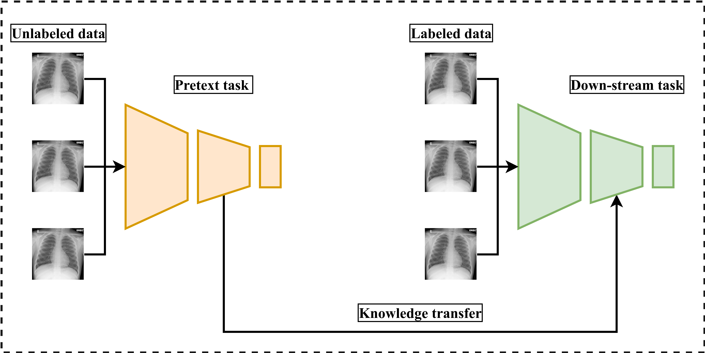

# Awesome Self-Supervised Learning in Medical Imaging [](https://awesome.re/)

This repository is mainly dedicated for listing the recent research advancements in the application of Self-Supervised-Learning in medical images computing field. Inspired by [awesome-self-supervised-learning](https://github.com/jason718/awesome-self-supervised-learning)


#### What is self-supervised learning?

Self-Supervised learning (SSL) is a hybrid learning approach that combines both supervised and unsupervised learning simultaneously. More clearly, SSL is an approach that aims at learning semantically useful features for a certain task by generating supervisory signal from a pool of unlabeled data without the need for human annotation. These representations is then used for subsequent tasks where the amount of labeled data is limited.

<p align="center" >
  
</p>


<p align="center">   <b>Self-Supervised Learning pipelines in computer vision</b> </p>


#### Why Self-Supervised learning in medical imaging ?

* Unlabeled medical imaging data is a abundant, but human annotated data is scarce.
* building a large enough human annotated medical imaging datasets is:
  1.  Expensive.
  2. Time consuming.
  3. Requires experienced personnel.
  4. Prone to patients’ privacy preserving issues.

## Contributing to the repository

<p align="center" >
  
</p>


Please help contribute this list by contacting [me](https://github.com/SaeedShurrab) or add [pull request](https://github.com/SaeedShurrab/awesome-selef-supervised-learning-in-medical-imaging/pulls)

Markdown format: height 

```
- Paper Name. 
  [[pdf]](link) 
  [[code]](link)
  - Author 1, Author 2, and Author 3. *Conference Year*
```


## Criteria

1. A list of **recent self-supervised learning papers** in medical imaging published since **2017**.

2. Papers are collected from peer-reviewed journals and high reputed conferences. However, it might have recent papers on arXiv.

3. A meta-data is required along the paper, e.g. category.

   


## List of Journals / Conferences (J/C):


- **[IEEE Access](https://ieeeaccess.ieee.org/)**
- **[IEEE Transaction on Medical Imaging (IEEE-TMI)](https://ieee-tmi.org/)**
- **[IEEE Transaction on Biomedical Engineering (IEEE-TBME)](http://tbme.embs.org/)**
- **[IEEE Journal of Biomedical and Health Informatics (IEEE-JBHI)](http://jbhi.embs.org/)**
- **[Applied Soft Computing (ASC)](https://www.sciencedirect.com/journal/applied-soft-computing)**
- **[Medical Image Analysis (MedIA)](https://www.journals.elsevier.com/medical-image-analysis/)**
- **[International Journal of Computer Assisted Radiology and Surgery (IJCARS)](https://link.springer.com/journal/11548)** 
- **[Nature Machine Intelligence (NMI)](https://www.nature.com/natmachintell/)**
- **[Pattern Recognition](https://www.sciencedirect.com/science/journal/00313203)**
- **[Expert Systems with Applications (ESA)](https://www.sciencedirect.com/journal/expert-systems-with-applications)**
- **[Neurocomputing](https://www.sciencedirect.com/journal/neurocomputing)**
- **Proceedings of Machine Learning Research (PMLR)**
- **Annual Conference on Neural Information Processing Systems (NIPS)**
- **International Conference on Information Processing in Medical Imaging (IPMI)**
- **International Conference on Medical Image Computing and Computer Assisted Intervention (MICCAI)**
- **International Conference on Medical Imaging with Deep Learning (MIDL)**
- **IEEE International Symposium on Biomedical Imaging (ISBI)**
- **Joint European Conference on Machine Learning and Knowledge Discovery in Databases (JECMLKDD)**
- **IEEE International Conference on Acoustics, Speech and Signal Processing (ICASSP)**
- **International Workshop on Deep Learning in Medical Image Analysis (DLMIA)**


## 2021


|                         Paper title                          | Journal/Conference  |           Category           |                          Paper link                          |                          Code link                           |
| :----------------------------------------------------------: | :-----------------: | :--------------------------: | :----------------------------------------------------------: | :----------------------------------------------------------: |
| Multimodal Self-supervised Learning for Medical Image Analysis |        IPMI         |          Predictive          | [Link](https://link.springer.com/chapter/10.1007/978-3-030-78191-0_51) |                             N/A                              |
| Self-supervised multimodal reconstruction pre-training for retinal computer-aided diagnosis |         ESA         |          Generative          | [Link](https://www.sciencedirect.com/science/article/pii/S0957417421009982) |                             N/A                              |
| MedAug: Contrastive learning leveraging patient metadata improves representations for chest X-ray interpretation |        ArXiv        |         Contrastive          |           [Link](https://arxiv.org/abs/2102.10663)           |                             N/A                              |
| COVID-19 Prognosis via Self-Supervised Representation Learning and Multi-Image Prediction |        ArXiv        |         Contrastive          |           [Link](https://arxiv.org/abs/2101.04909)           | [pytorch](https://github.com/facebookresearch/CovidPrognosis) |
| Momentum contrastive learning for few-shot COVID-19 diagnosis from chest CT images | Pattern Recognition |         Contrastive          | [Link](https://www.sciencedirect.com/science/article/abs/pii/S0031320321000133) |                             N/A                              |
| Big Self-Supervised Models Advance Medical Image Classification |        ArXiv        |         Contrastive          |           [Link](https://arxiv.org/abs/2101.05224)           |                             N/A                              |
| Self-supervised Multi-task Representation Learning for Sequential Medical Images |      JECMLKDD       | Multiple-tasks/Multi-tasking | [Link](https://link.springer.com/chapter/10.1007/978-3-030-86523-8_47) |                             N/A                              |
| Self-path: Self-supervision for classification of pathology images with limited annotations |         TMI         | Multiple-tasks/Multi-tasking |     [Link](https://ieeexplore.ieee.org/document/9343323)     |                             N/A                              |
| Twin self-supervision based semi-supervised learning (TS-SSL): Retinal anomaly classification in SD-OCT images |   Neurocomputing    | Multiple-tasks/Multi-tasking | [Link](https://www.sciencedirect.com/science/article/abs/pii/S0925231221012352) |     [tensorflow](https://github.com/ZhangYH0502/TS-SSL.)     |
| Rotation-oriented collaborative self-supervised learning for retinal disease diagnosis. |         TMI         | Multiple-tasks/Multi-tasking |     [Link](https://ieeexplore.ieee.org/document/9411868)     | [tensorflow](https://github.com/xmengli999/Rotation-oriented-self-supervised) |
| Volumetric white matter tract segmentation with nested self-supervised learning using sequential pretext tasks |        MedIA        | Multiple-tasks/Multi-tasking | [Link](https://www.sciencedirect.com/science/article/abs/pii/S1361841521001407) |                             N/A                              |


[Link](https://www.sciencedirect.com/science/article/abs/pii/S1361841521001407)


[tensorflow](https://github.com/xmengli999/Rotation-oriented-self-supervised)

[pytorch](https://github.com/facebookresearch/CovidPrognosis)


## 2020

|                         Paper title                          | Journal/Conference |           Category           |                          Paper link                          |                          Code link                           |
| :----------------------------------------------------------: | :----------------: | :--------------------------: | :----------------------------------------------------------: | :----------------------------------------------------------: |
| Self-Loop Uncertainty: A Novel Pseudo-Label for Semi-supervised Medical Image Segmentation |       MICCAI       |          Predictive          | [Link](https://link.springer.com/chapter/10.1007/978-3-030-59710-8_60) |                             N/A                              |
| Rubik’s Cube+: A self-supervised feature learning framework for 3D medical image analysis |       MedIA        |          Predictive          | [Link](https://www.sciencedirect.com/science/article/abs/pii/S1361841520301109) |                             N/A                              |
| Self-Supervised Learning Based on Spatial Awareness for Medical Image Analysis |    IEEE Access     |          Predictive          |     [Link](https://ieeexplore.ieee.org/document/9186121)     |                             N/A                              |
| Self-supervised Skull Reconstruction in Brain CT Images with Decompressive Craniectomy |       MICCAI       |          Generative          | [Link](https://link.springer.com/chapter/10.1007/978-3-030-59713-9_38) |       [pytorch](https://gitlab.com/matzkin/headctools)       |
| Learning the retinal anatomy from scarce annotated data using self-supervised multimodal reconstruction |        ASC         |          Generative          | [Link](https://www.sciencedirect.com/science/article/pii/S1568494620301502) |                             N/A                              |
| Multimodal Transfer Learning-based Approaches for Retinal Vascular Segmentation |       ArXiv        |          Generative          |           [Link](https://arxiv.org/abs/2012.10160)           |                             N/A                              |
| Multi-modal self-supervised pre-training for joint optic disc and cup segmentation in eye fundus images |       ICASSP       |          Generative          | [Link](https://ieeexplore.ieee.org/abstract/document/9053551) |                             N/A                              |
| Self-supervised retinal thickness prediction enables deep learning from unlabelled data to boost classification of diabetic retinopathy |        NMI         |          Generative          |  [Link](https://www.nature.com/articles/s42256-020-00247-1)  |       [tensorflow](https://github.com/theislab/DeepRT)       |
| Leveraging Self-supervised Denoising for Image Segmentation  |        ISBI        |          Generative          | [Link](https://ieeexplore.ieee.org/abstract/document/9098559) |       [tensorflow](https://github.com/juglab/VoidSeg)        |
| Self-Supervised Pretraining with DICOM metadata in Ultrasound Imaging |        PMLR        |          Generative          |    [Link](https://proceedings.mlr.press/v126/hu20a.html)     |                             N/A                              |
| Revisiting rubik’s cube: Self-supervised learning with volume-wise transformation for 3d medical image segmentation |       MICCAI       |          Generative          | [Link](https://link.springer.com/chapter/10.1007/978-3-030-59719-1_24) |                             N/A                              |
| Semi-supervised breast cancer histology classification using deep multiple instance learning and contrast predictive coding |       ArXiv        |         Contrastive          |           [Link](https://arxiv.org/abs/1910.10825)           |                             N/A                              |
| Embedding Task Knowledge into 3D Neural Networks via Self-supervised Learning |       ArXiv        |         Contrastive          |           [Link](https://arxiv.org/abs/2006.05798)           |                             N/A                              |
| PGL: Prior-Guided Local Self-supervised Learning for 3D Medical Image Segmentation |       ArXiv        |         Contrastive          |           [Link](https://arxiv.org/abs/2011.12640)           |          [pytorch](https://github.com/YtongXie/PGL)          |
| Self-Supervised Feature Learning via Exploiting Multi-Modal Data for Retinal Disease Diagnosis |        TMI         |         Contrastive          |     [Link](https://ieeexplore.ieee.org/document/9139411)     |   [pytorch](https://github.com/xmengli999/self_supervised)   |
| MoCo Pretraining Improves Representation and Transferability of Chest X-ray Models |        PMLR        |         Contrastive          | [Link](https://proceedings.mlr.press/v143/sowrirajan21a.html) |    [pytorch](https://github.com/stanfordmlgroup/MoCo-CXR)    |
| Contrastive learning of global and local features for medical image segmentation with limited annotations |       ArXiv        |         Contrastive          |           [Link](https://arxiv.org/abs/2006.10511)           | [tensorflow](https://github.com/krishnabits001/domain_specific_cl) |
| Self-Supervised Representation Learning for Ultrasound Video |        ISBI        | Multiple-tasks/Multi-tasking | [Link](https://ieeexplore.ieee.org/abstract/document/9098666) |                             N/A                              |
| A Multi-Task Self-Supervised Learning Framework for Scopy Images |        ISBI        | Multiple-tasks/Multi-tasking | [Link](https://ieeexplore.ieee.org/abstract/document/9098527) |                             N/A                              |
| 3D Self-Supervised Methods for Medical Imaging--update references |        NIPS        | Multiple-tasks/Multi-tasking | [Link](https://proceedings.neurips.cc/paper/2020/file/d2dc6368837861b42020ee72b0896182-Paper.pdf) | [tensorflow](https://github.com/HealthML/self-supervised-3d-tasks) |
| Retinal Image Classification by Self-Supervised Fuzzy Clustering Network |    IEEE Access     | Multiple-tasks/Multi-tasking |     [Link](https://ieeexplore.ieee.org/document/9091815)     |                             N/A                              |
| Learning semantics-enriched representation via self-discovery, self-classification, and self-restoration |       MICCAI       | Multiple-tasks/Multi-tasking | [Link](https://link.springer.com/chapter/10.1007/978-3-030-59710-8_14) |   [pytorch](https://github.com/fhaghighi/SemanticGenesis)    |
| SAR: Scale-Aware Restoration Learning for 3D Tumor Segmentation |       ArXiv        | Multiple-tasks/Multi-tasking |           [Link](https://arxiv.org/abs/2010.06107)           |                             N/A                              |


## 2019


|                         Paper title                          | Journal/Conference |           Category           |                          Paper link                          |                         Code link                         |
| :----------------------------------------------------------: | :----------------: | :--------------------------: | :----------------------------------------------------------: | :-------------------------------------------------------: |
| Self-Supervised Learning for Cardiac MR Image Segmentation by Anatomical Position Prediction |       MICCAI       |          Predictive          | [Link](https://link.springer.com/chapter/10.1007/978-3-030-32245-8_60) |                            N/A                            |
| Self-supervised Feature Learning for 3D Medical Images by Playing a Rubik’s Cube |       MICCAI       |          Predictive          | [Link](https://link.springer.com/chapter/10.1007/978-3-030-32251-9_46) |                            N/A                            |
| Self-supervised learning for medical image analysis using image context restoration |       MedIA        |          Generative          | [Link](https://www.sciencedirect.com/science/article/abs/pii/S1361841518304699) |                            N/A                            |
| Models Genesis: Generic Autodidactic Models for 3D Medical Image Analysis |       MICCAI       |          Generative          | [Link](https://link.springer.com/chapter/10.1007/978-3-030-32251-9_42) | [tensorflow](https://github.com/MrGiovanni/ModelsGenesis) |
| Surrogate Supervision for Medical Image Analysis: Effective Deep Learning From Limited Quantities of Labeled Data |        ISBI        | Multiple-tasks/Multi-tasking |    [Link](https://ieeexplore.ieee.org/document/8759553/)     |                            N/A                            |


## 2018


|                         Paper title                          | Journal/Conference |  Category  |                          Paper link                          | Code link |
| :----------------------------------------------------------: | :----------------: | :--------: | :----------------------------------------------------------: | :-------: |
| Exploiting the potential of unlabeled endoscopic video data with self-supervised learning |       IJCARS       | Generative | [Link](https://link.springer.com/article/10.1007/s11548-018-1772-0) |    N/A    |
| Improving Cytoarchitectonic Segmentation of Human Brain Areas with Self-supervised Siamese Networks |       MICCAI       | Predictive | [Link](https://link.springer.com/chapter/10.1007/978-3-030-00931-1_76) |    N/A    |


## 2017


|                         Paper title                          | Journal/Conference |  Category   |                          Paper link                          | Code link |
| :----------------------------------------------------------: | :----------------: | :---------: | :----------------------------------------------------------: | :-------: |
|           Self-supervised Learning for Spinal MRIs           |       DLMIA        | Contrastive | [Link](https://link.springer.com/chapter/10.1007/978-3-319-67558-9_34) |    N/A    |
| Self supervised deep representation learning for fine-grained body part recognition |        ISBI        | Predictive  |     [Link](https://ieeexplore.ieee.org/document/7950587)     |    N/A    |

