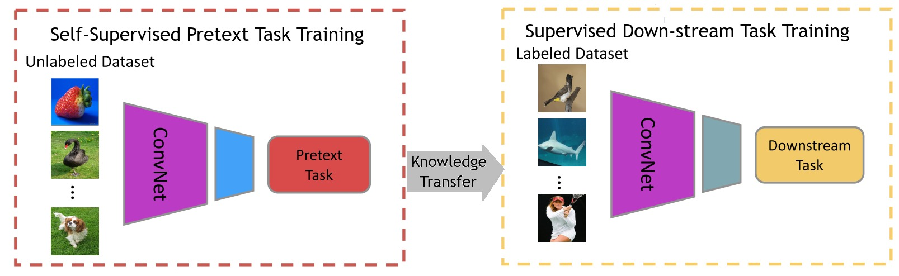

# Awesome Self-Supervised Learning in Medical Imaging[](https://awesome.re/)

This repository is mainly dedicated for listing the recent research advancements in the application of Self-Supervised-Learning in medical images computing field. Inspired by [awesome-self-supervised-learning](https://github.com/jason718/awesome-self-supervised-learning)


#### What is self-supervised learning?

Self-Supervised learning (SSL) is a hybrid learning approach that combines both supervised and unsupervised learning simultaneously. More clearly, SSL is an approach that aims at learning semantically useful features for a certain task by generating supervisory signal from a pool of unlabeled data without the need for human annotation. These representations is then used for subsequent tasks where the amount of labeled data is limited.

<p align="center" >
  
</p>

<p align="center">   <b>Self-Supervised Learning pipelines in computer vision</b> </p>


#### Why Self-Supervised learning in medical imaging ?

* Unlabeled medical imaging data is a abundant, but human annotated data is scarce.
* building a large enough human annotated medical imaging datasets is:
  1.  Expensive.
  2. Time consuming.
  3. Requires experienced personnel.
  4. Prone to patients’ privacy preserving issues.

## Contributing

<p align="center" >
  
</p>


Please help contribute this list by contacting [me](https://github.com/SaeedShurrab) or add [pull request](https://github.com/SaeedShurrab/awesome-selef-supervised-learning-in-medical-imaging/pulls)

Markdown format: height 

```
- Paper Name. 
  [[pdf]](link) 
  [[code]](link)
  - Author 1, Author 2, and Author 3. *Conference Year*
```

## Table of Contents

- [Theory](https://github.com/jason718/awesome-self-supervised-learning/blob/master/README.md#theory)
- Computer Vision (CV)
  - [Survey](https://github.com/jason718/awesome-self-supervised-learning/blob/master/README.md#survey)
  - [Image Representation Learning](https://github.com/jason718/awesome-self-supervised-learning/blob/master/README.md#image-representation-learning)
  - [Video Representation Learning](https://github.com/jason718/awesome-self-supervised-learning/blob/master/README.md#video-representation-learning)
  - [Geometry](https://github.com/jason718/awesome-self-supervised-learning/blob/master/README.md#geometry)
  - [Audio](https://github.com/jason718/awesome-self-supervised-learning/blob/master/README.md#audio)
  - [Others](https://github.com/jason718/awesome-self-supervised-learning/blob/master/README.md#others)
- Machine Learning
  - [Reinforcement Learning](https://github.com/jason718/awesome-self-supervised-learning/blob/master/README.md#reinforcement-learning)
  - [Recommendation Systems](https://github.com/jason718/awesome-self-supervised-learning/blob/master/README.md#recommendation-systems)
- [Robotics](https://github.com/jason718/awesome-self-supervised-learning/blob/master/README.md#robotics)
- [Natural Language Processing (NLP)](https://github.com/jason718/awesome-self-supervised-learning/blob/master/README.md#nlp)
- [Automatic Speech Recognition (ASR)](https://github.com/jason718/awesome-self-supervised-learning/blob/master/README.md#asr)
- [Graph](https://github.com/jason718/awesome-self-supervised-learning/blob/master/README.md#graph)
- [Talks](https://github.com/jason718/awesome-self-supervised-learning/blob/master/README.md#talks)
- [Thesis](https://github.com/jason718/awesome-self-supervised-learning/blob/master/README.md#thesis)
- [Blog](https://github.com/jason718/awesome-self-supervised-learning/blob/master/README.md#blog)

